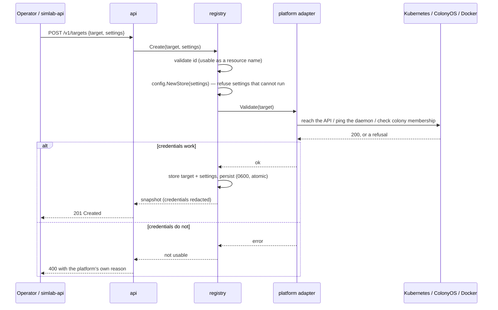
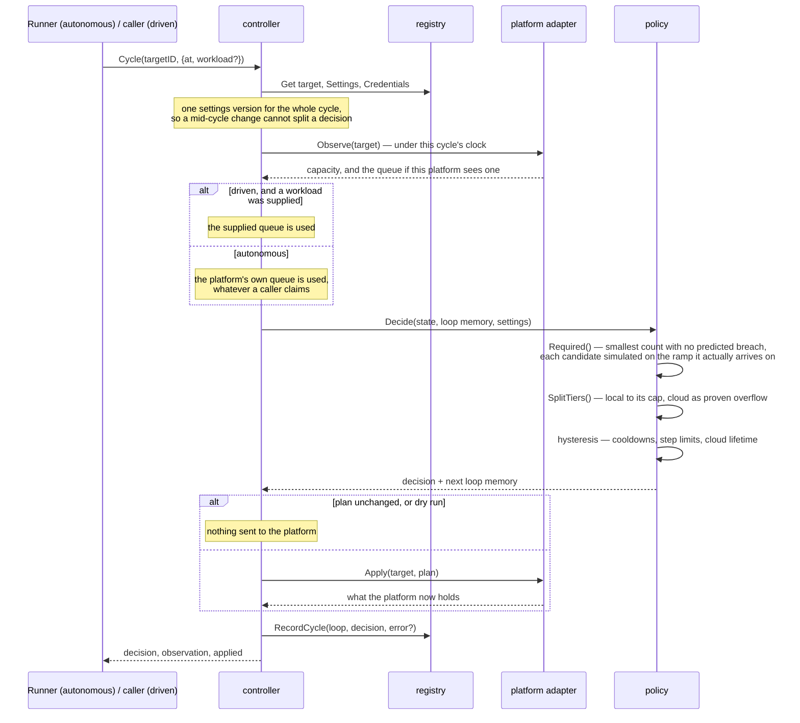
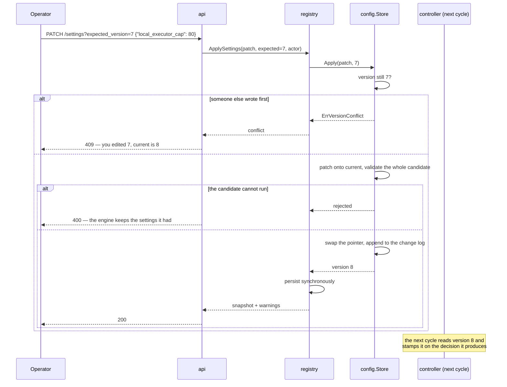
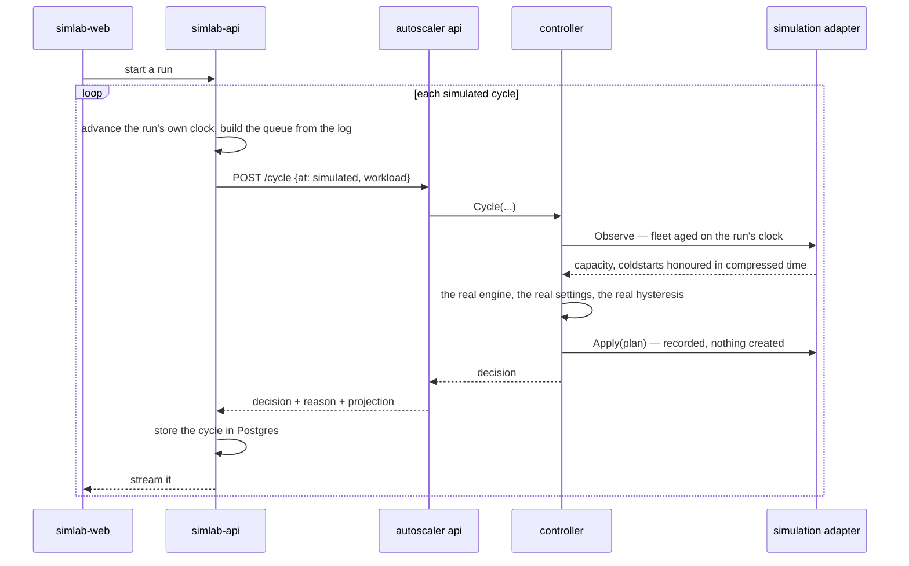

# How the pieces talk to each other

Four sequences cover everything this service does. They are drawn from the
code, not from intent — if one of them stops matching, the code is what
changed.

## 1. Registering a target

Nothing is stored until the platform has confirmed the access keys work. A
mistyped Deployment name or an expired token is refused while someone is
looking at the response, rather than discovered during the first burst the
target was supposed to absorb.

## 2. One control cycle

The same sequence whether the cycle came from the runner's ticker or from a
`POST /cycle`. That is the point: a simulation exercises this path, not a
model of it.

## 3. Changing settings while it runs

The headline property: no restart, no reload, and the change is in force on
the very next cycle.

## 4. A simulation run driving the real engine

This is how simlab exercises production logic without a cluster. Only the last
hop differs from a live target.

The substitution happens at exactly one point — the adapter — and everything
above it is the code that runs in production.
